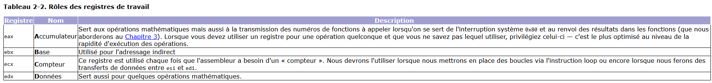

# Assembleur 
## Pour une architecture x86
### Notions importantes


**Leçon 1 : Hello world!**\n
1 - Crée un fichier `.asm` en faisant par exemple `touch helloworld.asm`
2 - Mettre un programme ex :

```asm
section .data
	message db 'Hello world!', 0xA ; création d'un message à afficher à l'écran, ici 'Hello world!' que l'on vient stocker dans message et 0xA permet d'ajouter un retour à la ligne plus ou moins équivalent à message = 'Hello world!\n'

section .text
	global _start ; Déclare la section de code, global déclare l'étiquette _start comme point d'entré du programme, un peut comme un apelle de fonction du genre : int main() { _sart(); }

_start:
	mov eax, 4 ; Apelle du syscall 4 qui correspond à sys_write voir https://github.com/torvalds/linux/blob/master/arch/x86/entry/syscalls/syscall_32.tbl pour plus d'infos
	mov ebx, 1 ; Charge le stdout dans 
	mov ecx, message ; Charge l'adresse de message dans l'ecx
	mov edx, 14 ; Charge la longeur de la châine dans edx
	int 0x80 ; Apelle le noyau pour effectuer l'appelle au syscall sys_write

  ; Sortie propre du programme
	mov eax, 1 ; Apelle du syscall 1 qui correpond à sys_exit
	xor ebx, ebx ; Met l'ebx à 0 pour avoir un exit(0)
	int 0x80 ; Apelle le noyau pour exécuter le sys_exit
```

3 - Pour assembler le fichier source `helloworld.asm` en utilisant le format de sortie obj et produit un fichier objet `helloworld.o` : `$nasm -f elf32 helloworld.asm -o helloworld.o`
4 - On assemble le fichier objet en utilisant l'architecture x86 et gener un exécutable : `ld -m elf_i386 helloworld.o -o helloworld`
